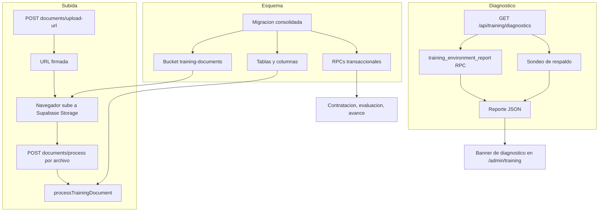

# Design — Reparación del Centro de Capacitación

## Overview

La reparación se organiza en cinco frentes, en este orden de dependencia:

1. **Diagnóstico del entorno.** Un reporte introspectivo que dice exactamente qué falta (tablas, columnas nulables, bucket, RPCs, membresía, variables de entorno). Sin esto, cualquier corrección de lógica es a ciegas.
2. **Aplicación del esquema.** Convertir `supabase/repair_training_v2.sql` en una migración versionada e idempotente, para que el esquema se aplique con el flujo normal de migraciones en lugar de pegado manual.
3. **Rediseño de la subida.** Mover la transferencia del archivo del servidor de Next.js a Supabase Storage mediante URL firmada, porque la ruta actual no puede funcionar en producción por límites de la plataforma de despliegue.
4. **Visibilidad de errores.** Reemplazar el fallo silencioso por una taxonomía de errores tipada que viaja hasta la interfaz con un motivo por archivo.
5. **Verificación del flujo completo.** Pruebas que cubran los puntos de ruptura del recorrido admin → publicación → contratación → acceso → módulos → evaluación.

El principio rector es **no reescribir funcionalidad que ya existe**. Las rutas de API, los stores y las páginas se conservan; se corrige el transporte del archivo, los contratos de error, se añade el diagnóstico y se garantiza que el esquema esté aplicado.

### Correcciones respecto a los requisitos

**`training_employees.user_id` sí existe.** El hallazgo 6 del documento de requisitos lo planteaba como dudoso. Se verificó: está declarada en `supabase/migrations/20260530_training_center.sql` como `user_id UUID REFERENCES auth.users(id) ON DELETE SET NULL`. La comprobación de `src/app/training/center/layout.tsx` es válida a nivel de esquema y el Requisito 8.5 se cumple sin cambios en la tabla. El diagnóstico igualmente la verifica, porque su ausencia sería un fallo silencioso.

**El middleware no bloquea el flujo.** Se revisó `src/middleware.ts`. `/training/*` está exento de autenticación salvo `/training/center`, y esa ruta igualmente pasa porque no figura en `PROTECTED_PREFIXES` ni en `needsProfileCheck`. Las rutas `/api/training/*` sí atraviesan el middleware por el matcher `/(api|trpc)(.*)`, lo que añade una consulta de sesión por petición, pero no las bloquea. Se descarta como causa.

## Restricciones de la plataforma de despliegue

Este apartado es nuevo respecto a la primera versión del diseño y es la razón del rediseño de la subida.

El repositorio contiene `.vercel/repo.json`, es decir, el proyecto se despliega en Vercel. Eso impone dos límites que la implementación actual de la subida ignora:

**Límite de cuerpo de petición.** Las funciones de Vercel rechazan peticiones cuyo cuerpo excede aproximadamente 4.5 MB, y lo hacen en la capa de plataforma, con `413`, **antes de que el handler de la ruta se ejecute**. La ruta actual acepta hasta 5 archivos de 15 MB cada uno en un único `multipart/form-data`, es decir hasta 75 MB. Un solo PDF de tamaño realista supera el límite.

El efecto es exactamente el síntoma reportado: en `next dev` no existe ese límite y la subida funciona; en producción falla y, por el fallo silencioso descrito en el Requisito 2, la interfaz muestra éxito. Esta restricción es suficiente por sí sola para explicar que "no suba documentos", con independencia del estado del esquema.

**Límite de duración de función.** `maxDuration = 300` solo es válido en planes que lo permitan; en otros la plataforma lo recorta. El bucle actual procesa los archivos en serie y cada uno puede gastar hasta 45 s en el análisis con IA, más el tiempo de extracción de texto. Un lote de 5 archivos puede agotar el presupuesto y abortar la petición completa, perdiendo también los archivos ya procesados en ese lote.

Ninguna de las dos restricciones pudo verificarse contra el despliegue real desde el entorno de desarrollo. Son límites documentados de la plataforma, y el diseño se corrige para no depender de ellos.

## Arquitectura



### Subida en tres pasos, y por qué

El archivo deja de atravesar el servidor de Next.js. El flujo pasa a ser:

**Paso 1 — `POST /api/training/documents/upload-url`.** El servidor valida membresía con `requireProgramAdmin(programId)`, comprueba que el programa esté en `draft` y que el `scope` sea coherente con `role_id`, genera un `documentId` y la ruta de destino, y devuelve una URL de subida firmada obtenida con `createSignedUploadUrl(path)` del cliente admin. La petición y la respuesta son JSON pequeño, así que el límite de 4.5 MB es irrelevante.

**Paso 2 — subida directa del navegador a Supabase Storage.** El cliente usa `uploadToSignedUrl(path, token, file)`. El archivo nunca pasa por Vercel, de modo que el techo real vuelve a ser el `file_size_limit` del bucket, que ya está configurado en 15 MB por la migración `202607180001`. Esto alinea el límite anunciado en la interfaz ("Max 15MB") con el límite efectivo, que hoy no se cumple.

**Paso 3 — `POST /api/training/documents/process`, un archivo por petición.** Recibe `{ programId, scope, documentId, storagePath, fileName }`. El servidor **descarga el objeto** con el cliente admin y a partir de ahí ejecuta la misma lógica que hoy: valida tamaño real, detecta el tipo con `detectTrainingFileKind` sobre los bytes, calcula el checksum, deduplica, extrae texto, analiza con IA, inserta la fila, los fragmentos y la asociación.

La decisión clave es que **la validación sigue ocurriendo en el servidor sobre los bytes reales**, no sobre lo que declara el cliente. El `fileType` y el `fileSize` que envía el navegador se usan solo para mensajes; la verificación de magia de archivo y de tamaño se hace tras la descarga. El modelo de confianza no se debilita: un cliente malicioso puede subir un objeto arbitrario a la ruta firmada, pero el paso 3 lo rechaza y lo borra.

Un archivo por petición hace la duración predecible y acota el fallo: si un archivo agota el tiempo, los demás no se pierden.

### Lógica de procesamiento compartida

**Archivo nuevo:** `src/lib/training/process-document.ts`

Toda la lógica del cuerpo del bucle actual se extrae a una función:

```ts
export async function processTrainingDocument(input: {
  admin: SupabaseClient;
  orgId: string;
  roleId: string | null;
  scope: 'role' | 'organization';
  programId: string;
  documentId: string;
  storagePath: string;
  fileName: string;
  fileBuffer: Buffer;
}): Promise<ProcessedTrainingDocument>;
```

Lanza `TrainingDocumentError` y mantiene intacta la reversión existente: borrado del objeto en storage y de la fila creada cuando la asociación no llegó a establecerse.

Esto permite que **la ruta actual `POST /api/training/documents` se conserve** como camino heredado para archivos pequeños y para las pruebas existentes, llamando a la misma función. No hay dos implementaciones de la lógica de negocio, solo dos transportes. La interfaz usa el camino nuevo; el heredado queda disponible y probado.

### Por qué un diagnóstico con sondeo de respaldo

El diagnóstico se implementa como función SQL `public.training_environment_report()` porque la introspección de catálogos (`information_schema`, `pg_proc`, `storage.buckets`) no es accesible desde el cliente JS de Supabase mediante `.from()`.

Pero hay una paradoja: si las migraciones no están aplicadas, la propia función de diagnóstico tampoco existe. Por eso el endpoint implementa **dos caminos**:

- **Camino preferente:** invoca `training_environment_report()` y devuelve el reporte completo y preciso.
- **Camino de respaldo:** si la RPC no existe (error `42883` / `PGRST202`), el endpoint ejecuta sondeos ligeros con el cliente admin: un `select` con `limit 0` por tabla, un `listBuckets()` para el storage, y un `rpc()` con argumentos inválidos por cada función para distinguir "no existe" (`42883`) de "existe pero rechazó los argumentos". Menos detallado, pero suficiente para decir qué migración falta.

Esta dualidad es lo que hace que el diagnóstico sea útil precisamente en el escenario roto.

### Por qué migración versionada en lugar del script manual

`supabase/repair_training_v2.sql` ya contiene todo lo necesario y es idempotente, pero vive fuera de `supabase/migrations/`, así que `supabase db push` no lo aplica y depende de que alguien lo pegue en el SQL Editor. Ese es exactamente el modo de fallo que se está reparando.

La corrección es añadir `supabase/migrations/202607280002_training_v2_consolidated_repair.sql` con el mismo contenido idempotente. Al ser todo `CREATE ... IF NOT EXISTS`, `CREATE OR REPLACE FUNCTION`, `ADD COLUMN IF NOT EXISTS` e `INSERT ... ON CONFLICT`, es seguro aplicarlo sobre una base ya migrada. El script original se conserva para el caso en que no haya acceso al CLI.

## Componentes y diseño

### 1. Reporte de entorno (SQL)

**Archivo nuevo:** `supabase/migrations/202607280001_training_environment_report.sql`

```sql
CREATE OR REPLACE FUNCTION public.training_environment_report()
RETURNS JSONB
LANGUAGE plpgsql
SECURITY DEFINER
SET search_path = public
AS $$ ... $$;
```

Forma del resultado:

```json
{
  "tables": { "training_documents": true, "training_document_chunks": false },
  "nullable_columns": {
    "training_documents.program_id": true,
    "training_documents.file_url": false,
    "training_employees.token": true
  },
  "columns": { "training_employees.user_id": true },
  "functions": {
    "hire_training_candidate": true,
    "complete_training_module_without_evaluation": false
  },
  "buckets": { "training-documents": { "exists": true, "public": false, "file_size_limit": 15728640 } },
  "indexes": { "uniq_published_training_program_per_role": true }
}
```

Las funciones verificadas son exactamente las trece RPC que el código invoca: `is_training_admin`, `calculate_training_progress`, `hire_training_candidate`, `publish_training_program`, `create_training_program`, `create_training_program_version`, `replace_training_modules`, `finalize_training_evaluation`, `complete_training_module_without_evaluation`, `increment_training_time`, `append_training_session_messages`, `detach_training_program_document` y `start_training_module`. El nombre real de la función que cierra un módulo sin evaluación es `complete_training_module_without_evaluation`; no existe ninguna `complete_training_module`.

`training_employees.token` se añade a las columnas nulables verificadas porque en el esquema base es `UNIQUE NOT NULL` y solo `202607180001` le quita la restricción. Si esa migración falta, `hire_training_candidate` falla al insertar sin `token`, y la contratación se rompe por la misma causa raíz que la subida.

Implementación: consultas a `information_schema.tables`, `information_schema.columns` (leyendo `is_nullable`), `pg_proc` unido a `pg_namespace`, `storage.buckets` y `pg_indexes`. `SECURITY DEFINER` con `search_path` fijo y `EXECUTE` concedido solo a `service_role`, siguiendo el patrón ya usado por `public.is_training_admin`.

### 2. Endpoint de diagnóstico

**Archivo nuevo:** `src/app/api/training/diagnostics/route.ts`

```
GET /api/training/diagnostics
GET /api/training/diagnostics?orgId={uuid}
```

- `orgId` es opcional. Si se omite, se resuelve desde `user_profiles.org_id` del usuario autenticado. Esto evita que la interfaz tenga que conocer el identificador para poder diagnosticar.
- Autorización con `requireOrgAdmin(orgId)`, reutilizando `src/lib/training/auth.ts`. No se expone sin autenticación porque revela estructura interna de la base de datos.
- `export const runtime = 'nodejs'`, coherente con el resto de rutas de training.

Respuesta:

```json
{
  "ok": false,
  "source": "rpc",
  "env": { "SUPABASE_SERVICE_ROLE_KEY": true, "OPENROUTER_API_KEY": false },
  "membership": { "role": "owner" },
  "checks": [
    {
      "id": "table.training_document_chunks",
      "label": "Tabla training_document_chunks",
      "status": "missing",
      "severity": "critical",
      "remediation": "Aplicar 202607180001_training_v2_foundation.sql"
    }
  ],
  "summary": { "passed": 19, "failed": 3, "warnings": 1 }
}
```

- `ok` es `true` solo si ningún check `critical` falla. `OPENROUTER_API_KEY` tiene severidad `warning`, no `critical`, porque los Requisitos 3.7 y 10.3 la tratan como degradación aceptable.
- Cada check lleva su `remediation` apuntando a la migración concreta. El mapeo vive en un módulo compartido para no duplicarse entre RPC y sondeo.

**Archivo nuevo:** `src/lib/training/diagnostics.ts`

Catálogo de checks esperados (tablas, columnas nulables, columnas presentes, funciones, bucket, índices) con etiqueta, severidad y remediación; las dos estrategias de recolección (`collectViaRpc`, `collectViaProbe`) y el normalizador que produce el array `checks`. Marcado con `import 'server-only'`.

### 3. Taxonomía de errores de documentos

**Archivo nuevo:** `src/lib/training/document-errors.ts`

```ts
export type TrainingDocumentErrorCode =
  | 'FILE_TOO_LARGE'
  | 'FILE_TYPE_MISMATCH'
  | 'STORAGE_UPLOAD_FAILED'
  | 'STORAGE_DOWNLOAD_FAILED'
  | 'TEXT_EXTRACTION_FAILED'
  | 'TEXT_TOO_SHORT'
  | 'DATABASE_INSERT_FAILED'
  | 'CHUNKS_INSERT_FAILED'
  | 'ASSOCIATION_FAILED'
  | 'UNKNOWN';

export class TrainingDocumentError extends Error {
  constructor(
    public code: TrainingDocumentErrorCode,
    public fileName: string,
    message: string,
    public cause?: unknown,
  ) { ... }
}
```

Más un mapa `DOCUMENT_ERROR_MESSAGES` con texto en español e inglés por código, para que la interfaz muestre un motivo legible sin inventar cadenas.

El diseño separa deliberadamente **causa técnica** de **mensaje al cliente**: `cause` se registra completo en el log del servidor (Requisito 2.5) y nunca se serializa en la respuesta.

`STORAGE_DOWNLOAD_FAILED` es nuevo respecto a la primera versión: con subida directa, el servidor ahora puede fallar al recuperar un objeto que el cliente afirma haber subido.

`NEEDS_OCR` deliberadamente **no** es un código de error. Un PDF escaneado se guarda con `status: 'needs_ocr'` y cuenta como procesado; la interfaz ya lo muestra como advertencia y `readyDocumentsCount` ya lo excluye de la generación de módulos. Se documenta para evitar reclasificarlo por error durante la implementación.

### 4. Rutas de subida

**Archivo nuevo:** `src/app/api/training/documents/upload-url/route.ts`

`POST` con `{ programId, scope, fileName, fileSize }`. Valida membresía, estado `draft`, coherencia de `scope` con `role_id`, y que `fileSize` no exceda `MAX_TRAINING_FILE_SIZE`. Devuelve `{ documentId, storagePath, signedUrl, token }`. La ruta se mantiene deterministaparalela a la actual: `{orgId}/{scope|roleId}/{documentId}/{nombreSaneado}`.

**Archivo nuevo:** `src/app/api/training/documents/process/route.ts`

`POST` con `{ programId, scope, documentId, storagePath, fileName }`. Descarga el objeto, delega en `processTrainingDocument` y responde con el documento procesado o con un `TrainingDocumentError` traducido. `maxDuration = 60`, suficiente para un archivo con análisis de IA acotado a 45 s.

Si la validación posterior a la descarga falla, la ruta **borra el objeto subido** antes de responder. Esto evita que queden huérfanos en el bucket por subidas directas rechazadas.

**Archivo modificado:** `src/app/api/training/documents/route.ts`

Se conserva como camino heredado. El cuerpo del bucle se sustituye por llamadas a `processTrainingDocument`. Cambia el cálculo de la respuesta:

| Situación | Status | `success` |
|---|---|---|
| Todos los archivos procesados | `200` | `true` |
| Al menos uno procesado y al menos uno fallido | `200` | `true` |
| Ningún archivo procesado | `422` | `false` |

Cada elemento de `failures` pasa a ser `{ fileName, code, message }`. Se añade un `console.error` estructurado por fallo con `{ code, fileName, cause }`.

El `422` en el fallo total satisface el Requisito 2.1 y devuelve significado a `res.ok`.

### 5. Cambios en la interfaz de configuración

**Archivo modificado:** `src/app/admin/training/configure/[programId]/page.tsx`

`handleParseDocuments` pasa a orquestar el flujo de tres pasos por archivo, en secuencia:

1. Pedir la URL firmada.
2. Subir con `uploadToSignedUrl` usando el cliente de Supabase del navegador.
3. Llamar a `process` y registrar el resultado.

Se añade estado por archivo (`pending`, `uploading`, `processing`, `done`, `failed`) que se pinta como panel bajo la zona de arrastre, con una fila por archivo y su motivo de fallo. El toast de una línea actual no sirve para varios archivos y se reserva para el resultado agregado.

Los archivos que fallaron **se conservan** en `uploadFiles` para poder reintentar; solo se retiran los que se procesaron. Hoy se limpia la lista completa, obligando a volver a seleccionar todo.

Un beneficio secundario: como cada archivo se sube por separado, el progreso es visible en lugar de un spinner opaco de hasta cinco minutos.

**Archivo modificado:** `src/app/admin/training/page.tsx`

Banner que consulta `GET /api/training/diagnostics` al cargar el panel y, si `ok` es falso, muestra los checks fallidos con su remediación. Reutiliza el patrón visual de `src/components/admin/SyncStatusBanner.tsx`, que ya existe para el mismo propósito en el módulo de pipeline. No se crea un componente nuevo si el existente admite parametrización.

### 6. Manejo de errores en el resto del flujo

Los Requisitos 4, 5, 6, 7, 10 y 11 comparten un patrón: el servidor ya rechaza correctamente las operaciones inválidas, pero el mensaje llega al cliente como `'Internal server error'` porque `trainingApiErrorResponse` colapsa todo lo que no sea `TrainingAuthError` en un 500 genérico.

**Archivo modificado:** `src/lib/training/http.ts`

Se introduce `TrainingOperationError` (mensaje + status) y `trainingApiErrorResponse` la reconoce, igual que hace con `TrainingAuthError`.

**Archivo nuevo:** `src/lib/training/rpc-errors.ts`

Mapa desde el identificador de excepción de Postgres al par `{ status, message }`, cubriendo `training_program_not_found`, `training_program_not_published`, `training_program_has_no_role`, `training_program_has_no_modules`, `training_document_in_use`, `candidate_result_not_found`, `candidate_org_mismatch`, `candidate_role_mismatch` y `forbidden`. Las rutas que invocan RPCs lo usan para convertir el error antes de responder.

Esto es lo que hace que los Requisitos 4.3, 5.1, 6.1, 6.3, 7.2 y 7.3 produzcan mensajes específicos en lugar de un 500 opaco. La ruta de evaluación ya inspecciona el texto de la excepción de forma manual (`'exception: training_document_in_use'` aparece en las pruebas actuales); el mapa centraliza ese parseo, hoy disperso.

### 7. Contratos de API afectados

| Endpoint | Cambio |
|---|---|
| `GET /api/training/diagnostics` | Nuevo |
| `POST /api/training/documents/upload-url` | Nuevo |
| `POST /api/training/documents/process` | Nuevo |
| `POST /api/training/documents` | Heredado; `failures[]` gana `code`; `422` si nada se procesó |
| `POST /api/training/programs/[id]/documents` | Errores de RPC traducidos a status y mensaje específicos |
| `DELETE /api/training/programs/[id]/documents` | `409` con motivo cuando el documento está en uso |
| `POST /api/training/generate-modules` | `409` con motivo cuando no hay documentos `ready` |
| `POST /api/training/programs/[id]/publish` | `409` con motivo por falta de módulos o publicación duplicada |
| `POST /api/training/hire-candidate` | `409` con motivo específico por cada precondición |
| `POST /api/training/access` | Sin cambios; ya distingue inválido, revocado y expirado |

Ningún endpoint cambia su forma de éxito, así que los stores y las páginas que consumen respuestas correctas no requieren adaptación.

## Modelo de datos

No se introducen tablas ni columnas nuevas. El esquema objetivo es exactamente el que definen las migraciones `202607180001`–`202607180005`, ya escritas. Las únicas adiciones son la función de diagnóstico y la migración consolidada de reparación.

Piezas que el diagnóstico verifica, con su origen:

| Elemento | Migración que lo provee |
|---|---|
| `training_documents.program_id` nulable | `202607180001` |
| `training_documents.file_url` nulable | `202607180001` |
| `training_employees.token` nulable | `202607180001` |
| `training_program_documents` | `202607180001` |
| `training_module_documents` | `202607180001` |
| `training_document_chunks` | `202607180001` |
| `training_access_sessions` | `202607180001` |
| Bucket `training-documents` privado, 15 MB | `202607180001` |
| `is_training_admin` | `202607180001` |
| `calculate_training_progress` | `20260530_training_center` |
| `hire_training_candidate` | `202607180002` |
| `publish_training_program` | `202607180002` |
| `create_training_program` | `202607180002` |
| `create_training_program_version` | `202607180002` |
| `replace_training_modules` | `202607180002` |
| `finalize_training_evaluation` | `202607180002` |
| `complete_training_module_without_evaluation` | `202607180002` |
| `increment_training_time` | `202607180002` |
| `append_training_session_messages` | `202607180002` |
| `detach_training_program_document` | `202607180003` |
| `start_training_module` | `202607180004` |
| Ajustes de acceso | `202607180005` |

## Estrategia de pruebas

Las pruebas viven en `src/__tests__/training/` siguiendo el patrón ya establecido: `vitest`, mock de `server-only`, y un `createFluentMock` que simula la API encadenable de Supabase.

### Pruebas nuevas

**`src/__tests__/training/upload-documents.test.ts`** (extender el existente)

- Responde `422` con `success: false` cuando todos los archivos fallan. Caso del Requisito 12.1 y el que hoy pasaría por éxito.
- Responde `200` con `success: true` y `failures` no vacío en el caso mixto.
- Cada `failures[i]` incluye un `code` de la taxonomía, verificado por separado para storage, inserción de documento e inserción de fragmentos.
- La causa técnica no aparece en el cuerpo de la respuesta.
- Las pruebas de reversión existentes siguen pasando tras la extracción de `processTrainingDocument`.

**`src/__tests__/training/upload-url.test.ts`** (nuevo)

- Devuelve URL firmada para un programa en `draft`.
- Rechaza si el programa no es `draft`.
- Rechaza si `fileSize` excede `MAX_TRAINING_FILE_SIZE`, sin generar URL.
- Rechaza `scope: 'role'` en un programa sin `role_id`.
- Responde `403` a un usuario sin rol `owner`/`admin`.

**`src/__tests__/training/process-document.test.ts`** (nuevo)

- Un objeto cuyos bytes no coinciden con la extensión declarada produce `FILE_TYPE_MISMATCH` y **se borra del bucket**. Esta es la prueba que protege el modelo de confianza de la subida directa.
- Un objeto cuyo tamaño real excede el límite produce `FILE_TOO_LARGE` y se borra.
- Fallo de descarga produce `STORAGE_DOWNLOAD_FAILED`.
- Un checksum duplicado reutiliza el documento existente y borra el objeto recién subido.

**`src/__tests__/training/diagnostics.test.ts`** (nuevo)

- Devuelve el reporte cuando la RPC existe.
- Cae al sondeo cuando la RPC responde `42883` y aún así identifica los elementos faltantes.
- Resuelve `orgId` desde `user_profiles` cuando no se pasa por query.
- Responde `403` a un usuario sin rol `owner`/`admin`.
- `OPENROUTER_API_KEY` ausente produce `warning`, no `failed`, y no altera `ok`.

**`src/__tests__/training/rpc-errors.test.ts`** (nuevo)

- Cada identificador de excepción del mapa produce su status y mensaje.
- Una excepción desconocida cae en `500` con mensaje genérico.

**`src/__tests__/training/access.test.ts`** (nuevo)

- Enlace válido crea sesión, fija cookie y revoca sesiones previas.
- Enlace inválido, revocado y expirado producen `401` con mensajes distinguibles (Requisito 12.4).

### Pruebas existentes que deben seguir pasando

`admin.test.ts`, `chat.test.ts`, `complete-module.test.ts`, `evaluate-module.test.ts`, `page.test.tsx`. El cambio a `422` solo aplica al fallo total, que ninguna prueba actual cubre. Se verifica ejecutando la suite completa.

### Verificación manual del extremo a extremo

Las pruebas unitarias con Supabase simulado no pueden confirmar que el esquema real esté aplicado ni que la subida directa funcione en producción. El recorrido manual es parte de la verificación:

1. `GET /api/training/diagnostics` devuelve `ok: true`.
2. Subir un PDF de más de 5 MB. Este es el caso que hoy falla en producción y funciona en local; debe funcionar en ambos.
3. Subir un PDF con texto, un DOCX, un TXT y un PDF escaneado. Verificar estados `ready`, `ready`, `ready`, `needs_ocr`.
4. Subir un archivo de 20 MB y confirmar que el motivo `FILE_TOO_LARGE` aparece en pantalla y que no queda objeto huérfano en el bucket.
5. Renombrar un `.exe` a `.pdf` y subirlo: debe rechazarse con `FILE_TYPE_MISMATCH` y borrarse del bucket.
6. Generar módulos, publicar, contratar un candidato y abrir el enlace emitido.
7. Recorrer un módulo con el tutor, completar la evaluación y confirmar el desbloqueo del siguiente.

Los pasos 2, 4 y 5 deben ejecutarse contra un despliegue de vista previa, no solo en local, porque los límites de plataforma solo se manifiestan allí.

## Riesgos y mitigaciones

**Aplicar la migración consolidada sobre una base con datos.** Es una operación de riesgo medio. Todo el contenido es idempotente y el diagnóstico se ejecuta antes y después para comparar, pero debe hacerse primero en un entorno de pruebas y con respaldo. No debe aplicarse directamente en producción sin confirmación explícita.

**La subida directa expone una ruta de escritura al navegador.** La URL firmada permite escribir un objeto arbitrario en una ruta concreta del bucket privado. Mitigaciones: la URL es de un solo uso y de vida corta; la ruta se deriva de un `documentId` generado por el servidor, no del cliente; el bucket es privado y tiene `file_size_limit` y `allowed_mime_types`; y el paso de procesamiento revalida los bytes y borra el objeto si no pasa. El riesgo residual es un objeto huérfano si el cliente sube y nunca llama a `process`, lo que se acota con una tarea de limpieza de objetos sin fila asociada.

**`org_members` sin poblar para el usuario actual.** Produce `403` en todo el módulo y es indistinguible de un problema de permisos legítimo. Mitigación: el diagnóstico reporta la membresía del usuario que consulta, así que el `403` se vuelve explicable. El backfill del script consolidado cubre el caso.

**Dos transportes de subida coexistiendo.** El camino heredado podría divergir del nuevo. Mitigación: la lógica de negocio vive en una sola función compartida; los transportes solo difieren en cómo obtienen el `Buffer`.

**Cambio de status a `422`.** Mitigación: el único consumidor del endpoint en el repositorio es `configure/[programId]/page.tsx`, que se actualiza en el mismo cambio.

**Dependencia de OpenRouter.** Sin `OPENROUTER_API_KEY` no hay resumen ni temas, y la calificación de preguntas abiertas queda limitada. Mitigación: los Requisitos 3.7 y 10.3 lo tratan como degradación declarada; el diagnóstico lo reporta como advertencia.

## Orden de ejecución

El orden importa porque cada frente depende del anterior:

1. Migración del reporte de entorno y endpoint de diagnóstico. Habilita ver el estado real.
2. Migración consolidada de reparación. Corrige el esquema.
3. Extracción de `processTrainingDocument` y taxonomía de errores, con el camino heredado apuntando a la función compartida. Sin cambio de comportamiento observable, salvo el `422`.
4. Rutas `upload-url` y `process`. Habilitan la subida directa.
5. Interfaz: orquestación de tres pasos, panel de estado por archivo y banner de diagnóstico.
6. Traducción de errores de RPC en el resto de las rutas.
7. Pruebas y verificación del recorrido completo, incluida la vista previa desplegada.
